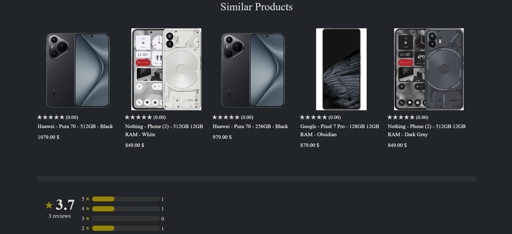

# Techie - E-commerce website for tech products

## Getting Started

To get the application up and running, follow these steps:

## 1. Configure Your Cloudinary Details
- Ensure you have a Cloudinary account and have noted your Cloudinary credentials (`cloud_name`, `api_key`, and `api_secret`).
- Update the Cloudinary parameters in `application.properties` (located in `src/main/resources`) with these details.
```properties
     cloudinary.cloud_name=${CLOUDINARY_NAME}
     cloudinary.api_key=${CLOUDINARY_API_KEY}
     cloudinary.api_secret=${CLOUDINARY_API_SECRET}
```

## 2. Configure and Populate the Database

1. **Connect to Your Database**
    - Replace the placeholders `${DB_DATABASE}`, `${DB_USER}`, and `${DB_PASSWORD}` with your schema name and database credentials (in `application.properties`).
      ```properties
      spring.datasource.url=jdbc:mysql://localhost:3306/your_database
      spring.datasource.username=your_username
      spring.datasource.password=your_password
      ```

2. **Create Database Tables**
    - The application uses Hibernate to automatically create the necessary database tables upon startup.
    - Launch the application; it will create the tables for you. You can stop the application after this step.

3. **Populate Tables with Initial Data**
    - Execute the `data.sql` file located in the `src/main/resources` directory.
    - This step will populate your tables with the essential initial data.

4. **Start the Application**
    - After creating and populating the database tables, start the application again.
    - Additional data will be populated during startup using `@PostConstruct` methods. This process takes about 17 seconds.

## 3. Run a MailHog Server

- To test the email functionalities, ensure you have a MailHog server running. The application is configured to use MailHog for email testing purposes and is not set up for real email providers.
- You can download and run MailHog from [MailHog's GitHub repository](https://github.com/mailhog/MailHog).

---

That’s it! Your application should now be configured and running.


### Products page
Dynamic filtering, with filters and filter option counters automatically updating on reload. Sorting by different criteria (by price lowest to highest and vice versa, by rating, by discount, by newest). Pagination of 25 products per page.


### Product page № 1
Smooth transition change of main picture when hovering over one of the thumbnail images. Specs and description. Anonymous and authenticated users can add a product to their shopping cart. Only authenticated users, however, can use their wishlist. 
If a user has more than one wishlist, clicking on the "Save" button, makes a dropdown menu expand, containing the names of the wishlists.


### Compare products page
If the user navigates from the 'compare' button on a product page, the corresponding product is shown as the first option. Only products from the same category as an already displayed product are suggested.


### Product page № 2
Products of similar price range and of the same category are suggested as "Similar Products".



### Product page № 3
Authenticated users can write reviews and upload up to 3 photos per review. They can also vote thumbs up or thumbs down on each reviewer's review. Authors of reviews can edit or delete their own reviews, while moderators and admins can delete any review.


### Database diagram
The database is populated with 521 products of different kinds. The product entity is inherited by various child entities (laptop, smartphone, etc.), which add their own fields in addition to the attributes of the parent product entity.
The `persistent_logins` table is used to support the "Remember Me" functionality for user authentication. When users choose to stay logged in across browser sessions, their login information is stored securely in this table.


### Index page 1
Header navbar hides when scrolling down and reappears when scrolling up. Search bar shows product suggestions on queries of at least 3 characters. Suggestions are sorted by highest rating.


### Index page 2
Custom-designed banners and a gallery containing some of the brands' logos.


### Index page 3
The footer is present in almost every view of the application. It contains social media buttons and an option for users to subscribe to the application's newsletter. The newsletter consists of emails about product promotions.


### Shopping cart
Unauthenticated users can also place orders, and their email addresses are stored in the order history database table. If they later create an account using the same email address, any orders they placed while anonymous are associated with their new account.
If the order is successful, the user is redirected to a new order confirmation page, which indicates that the order is complete and an email is sent to the user.


### Order history
The order history page displays all orders made by a given user. It uses pagination, showing 6 order history items per page. When a user clicks on an order history item, the details of that specific order are shown.


### Addresses page
Address line 2 is optional and hidden if empty.


### Wishlists page


### Settings page
Options to: delete account, change password, change subscription status and edit details


### Login page
If an anonymous user tries to do something they don't have permission for, they will likely be redirected here.


### Admin page 1
Users who do not possess an 'Admin' or 'Moderator' role do not have access to or visibility of the respective 'Admin' or 'Moderator' pages. 
Admins can add the 'Moderator' role to users via the dashboard. The 'Admin' role can be added programmatically using the RoleAdder class located in the config directory.


### Admin page 2
Admins and moderators can apply discounts to products. When this happens, subscribed users receive email notification.


### Admin page 3
Admins can blacklist users, but they must provide a reason for doing so. Blacklisted users are restricted from all actions. When they attempt to log in, a predefined blacklisted page is displayed.


### The products:


