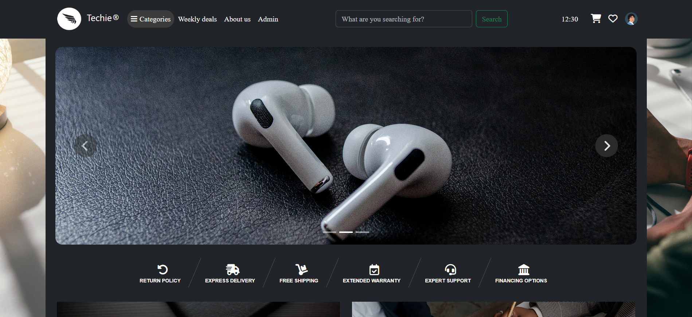
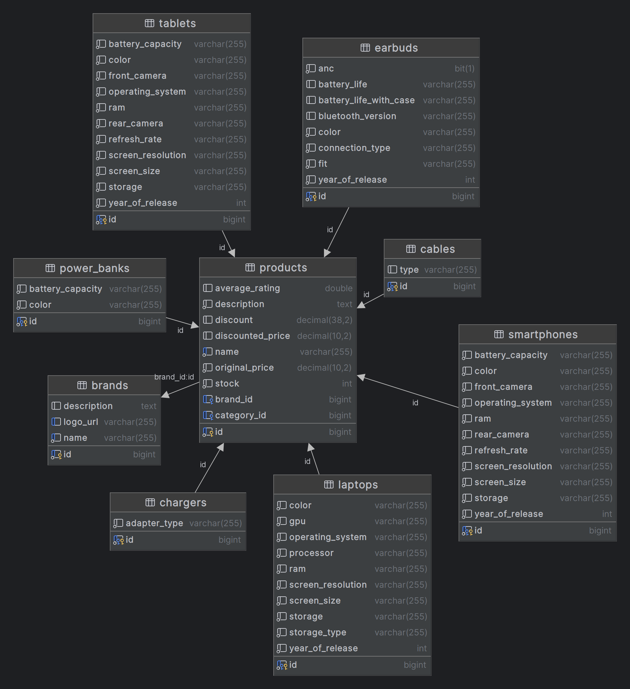

# Techie - E-commerce website for tech products

### Running the Application

To get the application up and running, follow these steps:

1. **Connect to your database:** In the `application.properties` file, replace `${DB_DATABASE}`, `${DB_USER}`, and `${DB_PASSWORD}` with your schema name and database credentials. The schema will be created automatically when the application starts.

2. **Create Database Tables:** The application is configured to automatically create the necessary database tables on startup using Hibernate. Simply launch the application, and it will handle this for you. Stop it afterward.

3. **Populate Tables with Initial Data:** Execute the `data.sql` file located in the `src/main/resources` directory of the project. This will populate the tables with essential data.

4. **Start the Application:** Now that the tables are created and populated, you can launch the application again. Additional data will be populated during startup using `@PostConstruct` methods (takes about 17 seconds).

That's it!

### Product page sample
Smooth transition change of main picture when hovering over one of the thumbnail images. Specs and description. Comparing option with other products of the same category. Rating and reviewing. Similar products.

### Compare products page sample
If the user navigates from the 'compare' button on a product page, the corresponding product is shown as the first option. Only products from the same category as an already displayed product are suggested.

### Products page sample № 1
Dynamic filtering, with filters and filter option counters automatically updating on reload. Sorting and pagination.

### Products page sample № 2

### Index page current state
Header hides when scrolling down and reappears when scrolling up. Search bar shows product suggestions on queries of at least 3 characters. Suggestions are sorted by highest rating.

### Database diagram (as of right now)
The database is populated with 521 products of different kinds. The product entity is inherited by various child entities (laptop, smartphone, etc.), which add their own fields in addition to the attributes of the parent product entity.

### The products:

