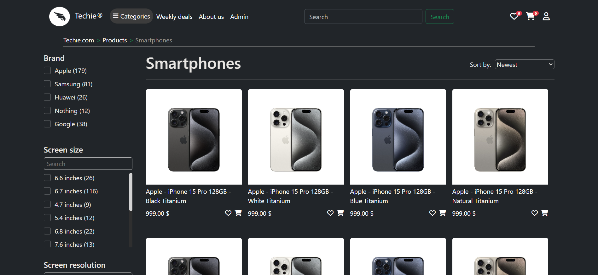
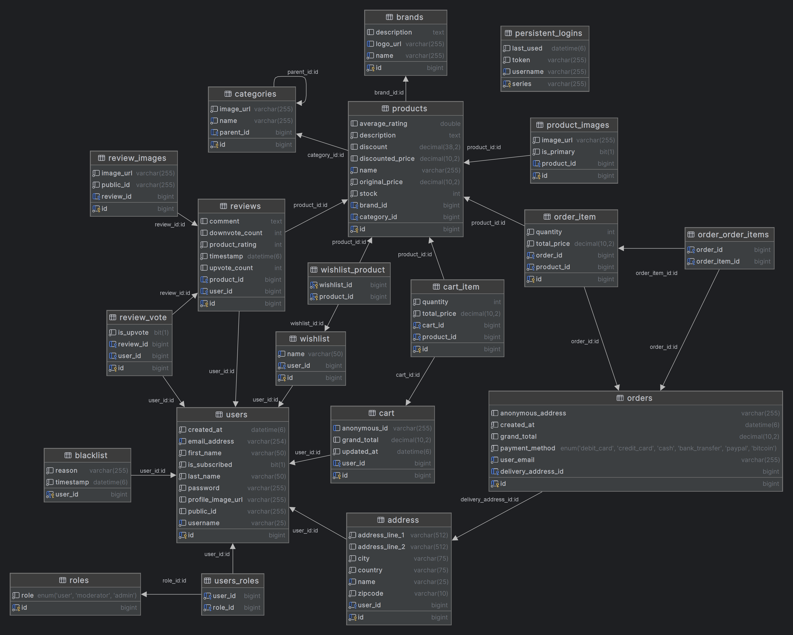

# Techie - E-commerce website for tech products

### Running the Application

To get the application up and running, follow these steps:

1. **Connect to your database:** In the `application.properties` file, replace `${DB_DATABASE}`, `${DB_USER}`, and `${DB_PASSWORD}` with your schema name and database credentials. The schema will be created automatically when the application starts.

2. **Create Database Tables:** The application is configured to automatically create the necessary database tables on startup using Hibernate. Simply launch the application, and it will handle this for you. Stop it afterward.

3. **Populate Tables with Initial Data:** Execute the `data.sql` file located in the `src/main/resources` directory of the project. This will populate the tables with essential data.

4. **Start the Application:** Now that the tables are created and populated, you can launch the application again. Additional data will be populated during startup using `@PostConstruct` methods.

That's it!

### Products page sample

### Index page current state

### Database diagram (as of right now)
The product entity (table) is inherited by various child entities (laptop, smartphone, etc.), which add their own fields (attributes) in addition to the attributes of the parent product entity. Pictures are shown below.

### The products:

