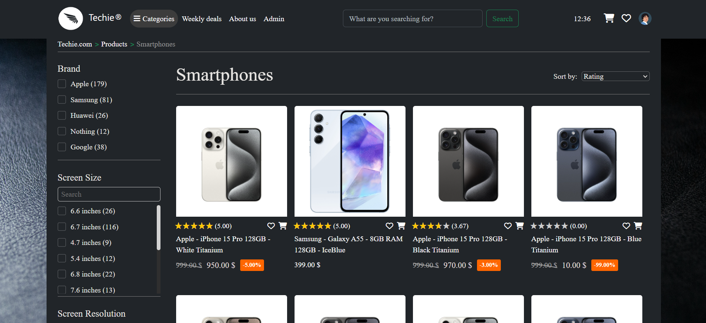

# Techie - E-commerce website for tech products

## Getting Started

To get the application up and running, follow these steps:

## 1. Configure Your Cloudinary Details
- Ensure you have a Cloudinary account and have noted your Cloudinary credentials (`cloud_name`, `api_key`, and `api_secret`).
- Update the Cloudinary parameters in `application.properties` (located in `src/main/resources`) with these details.
```properties
     cloudinary.cloud_name=${CLOUDINARY_NAME}
     cloudinary.api_key=${CLOUDINARY_API_KEY}
     cloudinary.api_secret=${CLOUDINARY_API_SECRET}
```

## 2. Configure and Populate the Database

1. **Connect to Your Database**
    - Replace the placeholders `${DB_DATABASE}`, `${DB_USER}`, and `${DB_PASSWORD}` with your schema name and database credentials (in `application.properties`).
      ```properties
      spring.datasource.url=jdbc:mysql://localhost:3306/your_database
      spring.datasource.username=your_username
      spring.datasource.password=your_password
      ```

2. **Create Database Tables**
    - The application uses Hibernate to automatically create the necessary database tables upon startup.
    - Launch the application; it will create the tables for you. You can stop the application after this step.

3. **Populate Tables with Initial Data**
    - Execute the `data.sql` file located in the `src/main/resources` directory.
    - This step will populate your tables with the essential initial data.

4. **Start the Application**
    - After creating and populating the database tables, start the application again.
    - Additional data will be populated during startup using `@PostConstruct` methods. This process takes about 17 seconds.

## 3. Run a MailHog Server

- To test the email functionalities, ensure you have a MailHog server running. The application is configured to use MailHog for email testing purposes and is not set up for real email providers.
- You can download and run MailHog from [MailHog's GitHub repository](https://github.com/mailhog/MailHog).

---

That’s it! Your application should now be configured and running.


### Product page sample
Smooth transition change of main picture when hovering over one of the thumbnail images. Specs and description. Comparing option with other products of the same category. Rating and reviewing. Similar products.



### Compare products page sample
If the user navigates from the 'compare' button on a product page, the corresponding product is shown as the first option. Only products from the same category as an already displayed product are suggested.


### Products page sample № 1
Dynamic filtering, with filters and filter option counters automatically updating on reload. Sorting and pagination.


### Products page sample № 2


### Index page current state
Header hides when scrolling down and reappears when scrolling up. Search bar shows product suggestions on queries of at least 3 characters. Suggestions are sorted by highest rating.


### Database diagram (as of right now)
The database is populated with 521 products of different kinds. The product entity is inherited by various child entities (laptop, smartphone, etc.), which add their own fields in addition to the attributes of the parent product entity.


### The products:


